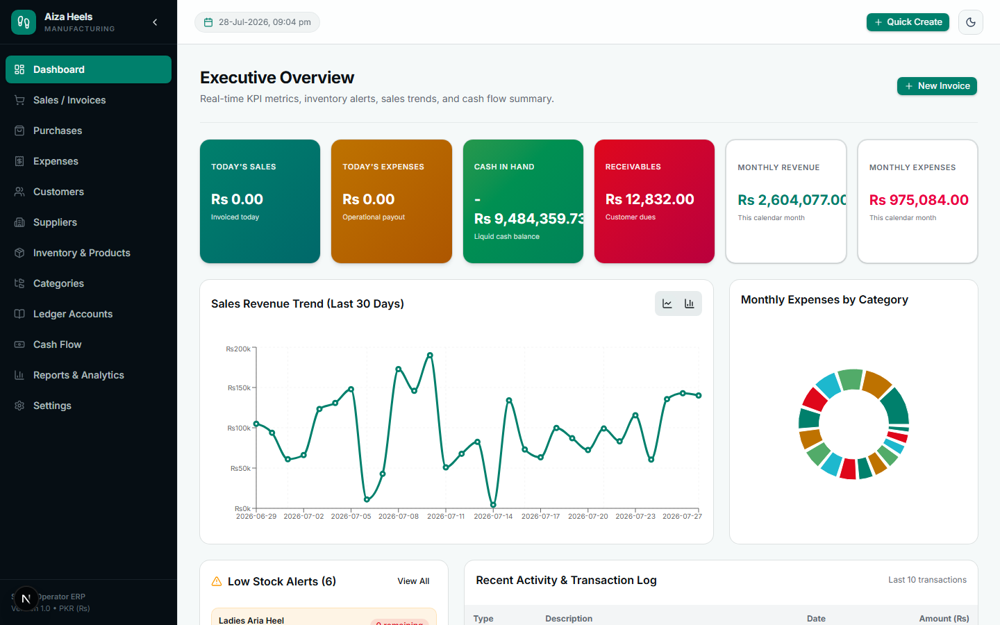
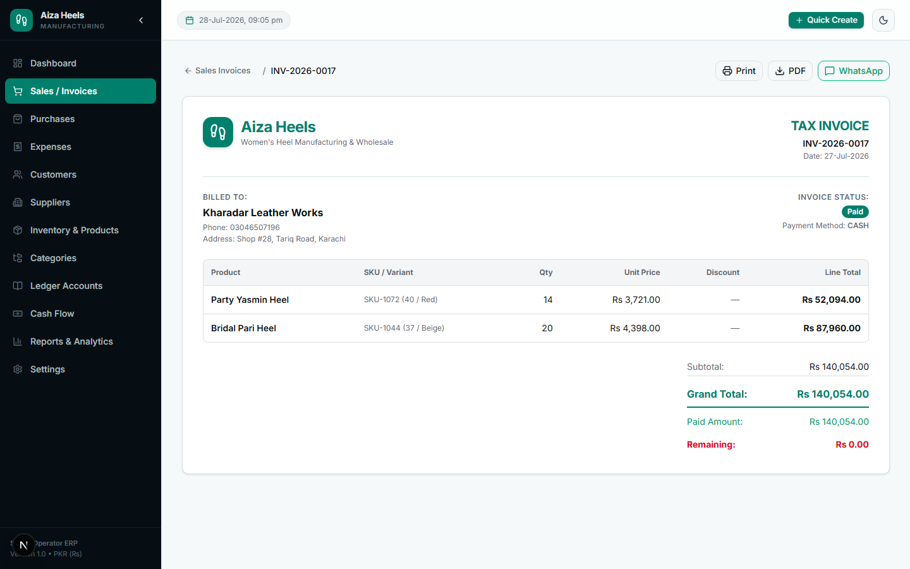
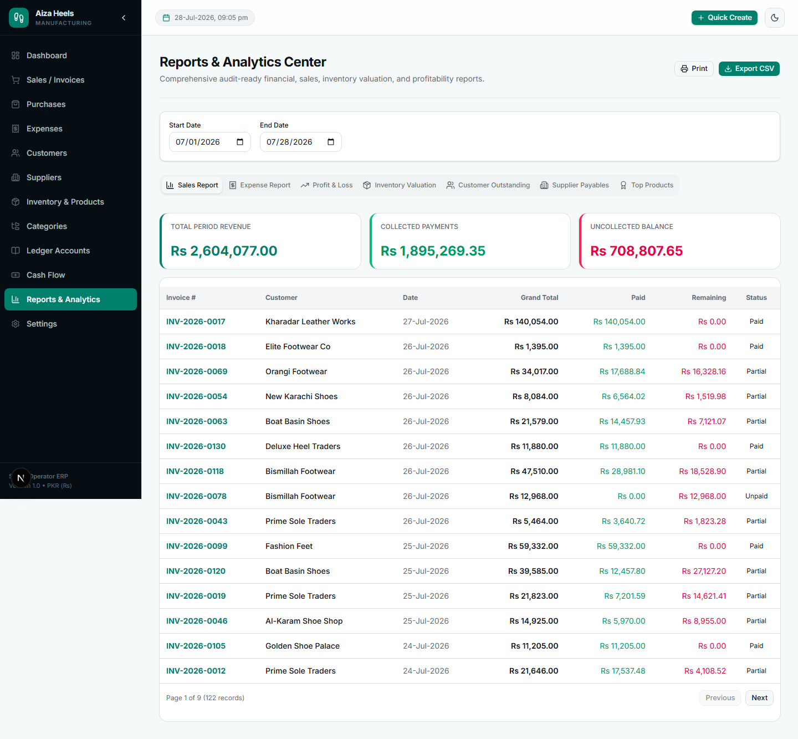
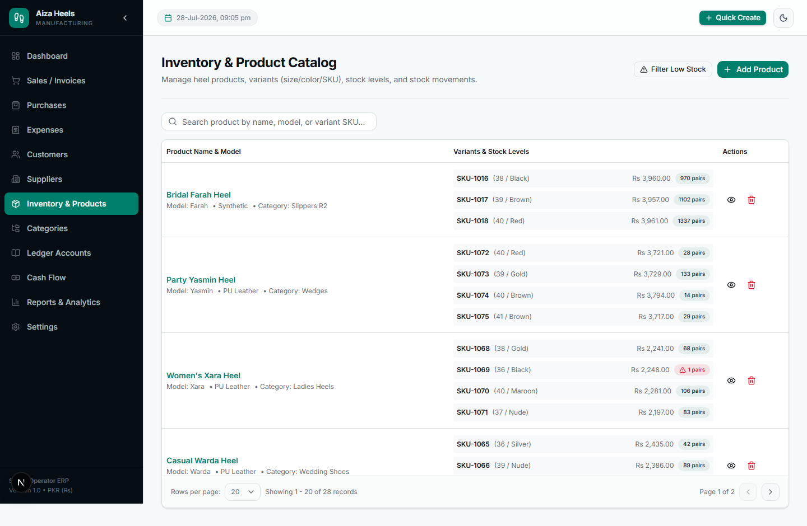
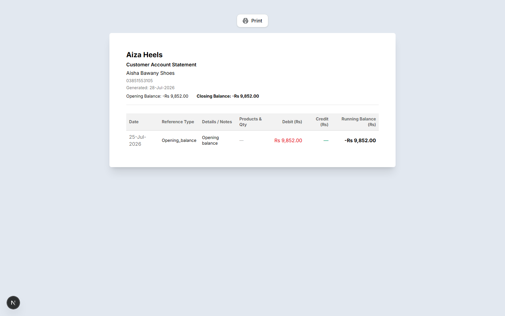
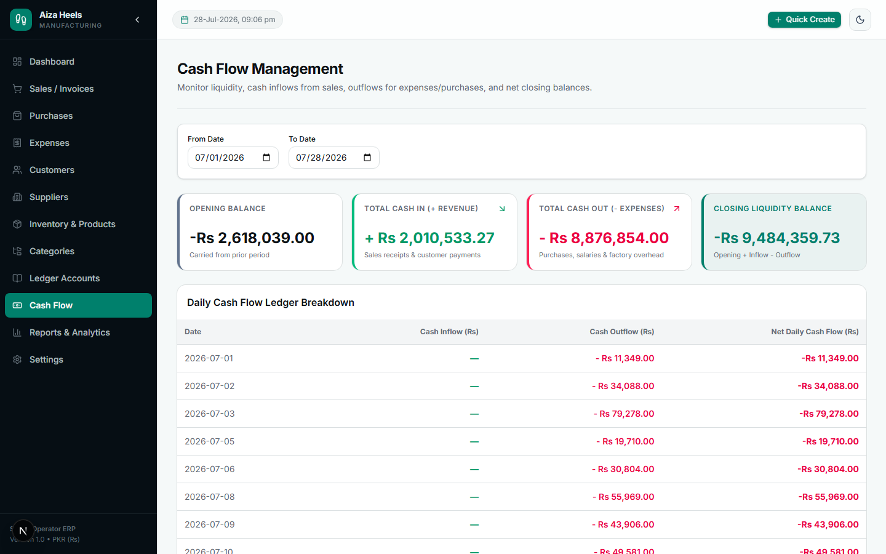
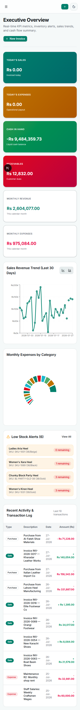

# Aiza Heels — ERP for Heel Manufacturing & Wholesale

A production-quality, single-operator Business Management System (ERP) built for a women's heel manufacturing and wholesale business. Handles sales invoicing, purchasing, inventory with size/color variants, customer & supplier ledgers, expenses, cash flow, and financial reporting — all in one place.



---

## Features

- **Executive Dashboard** — real-time KPIs, 30-day sales trend, expense breakdown by category, low-stock alerts, unified recent-activity feed.
- **Sales & Invoicing** — multi-line invoices, per-line and invoice-level discounts, tax, atomic sequential invoice numbers (`INV-YYYY-NNNN`), stock validation before checkout, partial payments, PDF export, print-ready view.
- **Purchases** — record incoming stock from suppliers, automatic stock increment, variant cost price updates, supplier ledger entries.
- **Inventory & Products** — product catalog with size/color/SKU variants, per-variant stock levels and pricing, low-stock threshold alerts, full stock-movement audit trail (sale / purchase / manual adjustment).
- **Customers & Suppliers** — contact management, opening balances, per-account transaction history, outstanding balance tracking.
- **Unified Ledger** — customer, supplier, cash, and expense ledgers with running balances; printable per-account statements (paper-style print preview).
- **Cash Flow** — opening/closing liquidity, daily cash in/out breakdown.
- **Reports & Analytics** — Sales, Expenses, Profit & Loss (with COGS), Inventory Valuation, Customer Receivables, Supplier Payables, and Top-Selling Products, each with date-range filtering, pagination, and CSV export.
- **Responsive** — usable on desktop, tablet, and mobile (off-canvas nav drawer on small screens).

---

## Screenshots

| | |
|---|---|
| **Sales Invoice** | **Profit & Loss Report** |
|  |  |
| **Inventory & Variants** | **Ledger Statement (print preview)** |
|  |  |
| **Cash Flow** | **Mobile** |
|  |  |

---

## Tech Stack

- **Framework**: Next.js 16 (App Router, Turbopack, Route Handlers)
- **Language**: TypeScript (strict)
- **Database**: SQLite via [`@libsql/client`](https://github.com/tursodatabase/libsql-client-ts) + [Drizzle ORM](https://orm.drizzle.team/) — single local `.db` file, zero external services required
- **Styling/UI**: Tailwind CSS + [Base UI](https://base-ui.com/) primitives (shadcn-style component layer)
- **Validation**: Zod (shared schemas across client forms and API routes)
- **PDF**: `@react-pdf/renderer`
- **CSV export**: `papaparse`
- **Charts**: Recharts

All monetary values are stored as **integer paisa** (1 PKR = 100 paisa) to avoid floating-point drift, converted at the API boundary.

---

## Getting Started

### Prerequisites

- Node.js 18+

### Install & run

```bash
npm install
npm run seed    # populates sample customers, suppliers, products, sales, purchases, expenses
npm run dev
```

Open [http://localhost:3000](http://localhost:3000).

#### Skip seeding — use the bundled sample database

A ready-made SQLite database with the same seed data is included at [`docs/sample.db`](docs/sample.db). To use it instead of running `npm run seed`:

```bash
npm install
cp docs/sample.db aizaheels.db
npm run dev
```

### Production build

```bash
npm run build
npm run start
```

### Environment variables (optional)

```ini
DATABASE_URL=file:./aizaheels.db        # defaults to this if unset
WHATSAPP_ACCESS_TOKEN=...               # optional, enables WhatsApp invoice delivery
WHATSAPP_PHONE_NUMBER_ID=...
WHATSAPP_BUSINESS_ACCOUNT_ID=...
```

---

## Project Structure

```
app/                    Next.js App Router pages + API route handlers
  (dashboard)/          Dashboard-layout pages (sales, purchases, products, reports, ...)
  api/                  REST-style API routes
  ledger-statement/     Standalone printable account-statement page
components/             Shared UI + shadcn-style component primitives
services/               Business logic layer (one file per domain: sale, purchase, ledger, ...)
lib/                    DB client, schema, currency/date helpers, PDF generation
drizzle/                Generated SQL migrations
scripts/seed.ts         Sample-data seed script
```
